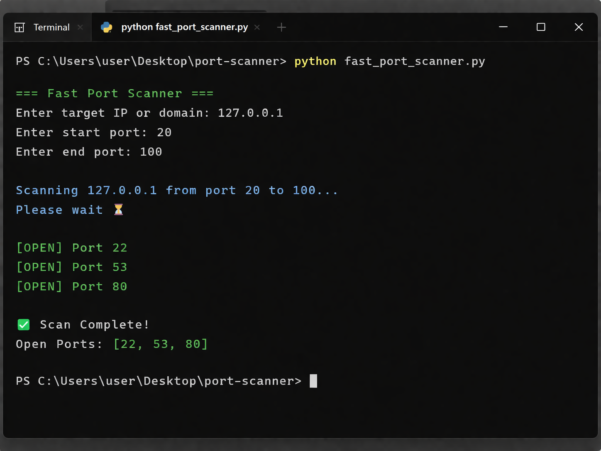

# 🔐 Fast Port Scanner

A fast multi-threaded TCP port scanner built with Python using sockets and threading.

## 🚀 New Features
- Detects running services (SSH, HTTP, etc.)
- Shows service version (if available)

## 📂 Project File
- fast_port_scanner.py

## ▶️ How to Run

```bash
python fast_port_scanner.py
```
## 📌 Example

```bash
Port 22 → SSH | Version: OpenSSH_8.2
Port 80 → HTTP | Version: Apache/2.4.41
```
 
